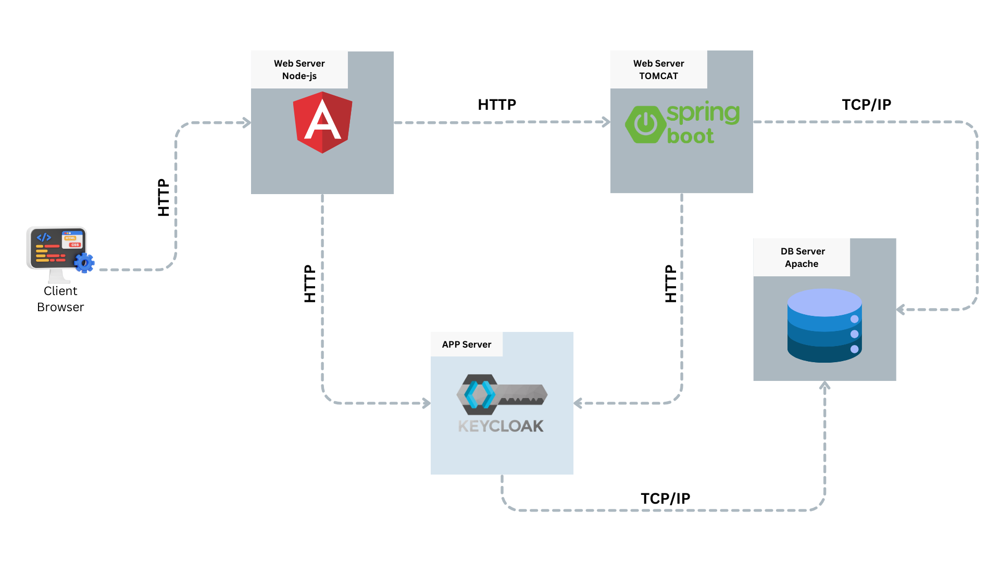

# Camp Esprit Project

This project consists of two main components:
1. **camp-esprit-client**: An Angular application serving as the client interface.
2. **camp-esprit-server**: A Spring Boot application serving as the backend server.

## Prerequisites

Before you begin, ensure you have the following installed on your machine:

- **Node.js** (with npm)
- **Angular CLI**
- **Java JDK 11 or higher**
- **Maven**
- **Git**

## Physical Architecture

The physical architecture of the project is as follows:


## Installation

### 1. Clone the Repository

```bash
git clone https://github.com/melekhomrani/camp-esprit.git
cd camp-esprit

```

### 2. Setting Up the Server (Spring Boot)
Navigate to the camp-esprit-server directory and build the project using Maven.

```bash
cd camp-esprit-server
mvn clean install
```

The server will be running on `http://localhost:8081`.

### 3. Setting Up the Client (Angular)
Navigate to the camp-esprit-client directory and install the dependencies.

```bash
cd camp-esprit-client
npm install
```

Run the Angular application.

```bash
ng serve
```

The client will be running on `http://localhost:4200`.

## Project Structure
camp-esprit
```
├── camp-esprit-client
│   ├── src
│   │   ├── app/
│   │   ├── assets/
│   ├── angular.json
│   ├── package.json
│   └── tsconfig.json
├── camp-esprit-server
│   ├── .mvn/
│   ├── src/
│   └── pom.xml
├── LICENSE
└── README.md 
```

## Configuration
### Server Configuration
The server configuration can be found in the `application.properties` file located in the `src/main/resources` directory.

### Client Configuration
The client configuration can be found in the `environment.ts` file located in the `src/app/utils` directory.

## License
This project is licensed under the MIT License - see the [LICENSE](LICENSE) file for details.
